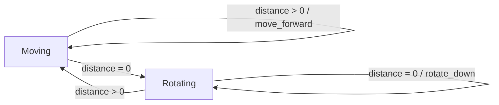
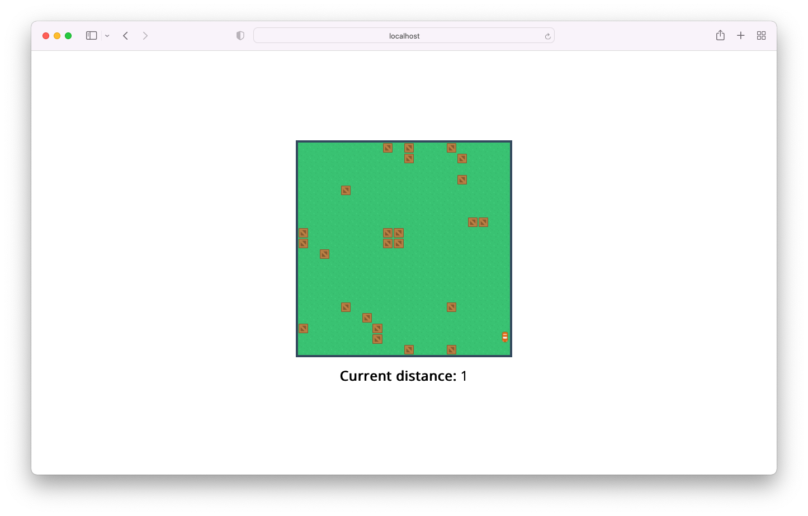

# ROS Sample
This is a ROS-sample project that runs with Docker. It starts four nodes:
* A web interface that visualizes the environment, the robot and possible obstacles
* A node that scans the environment (emits a stub environment map)
* A node that controls the robot platform, can receive commands and emits the position and rotation of the robot
* A node that computes the distance till the next object in front of the robot

## Requirements
* Docker

## Getting started
* Run `docker compose up`
* The interface should be available on `localhost:8080`!

## Controller
The behaviour of the controller can roughly be defined as follows:

## Sample
